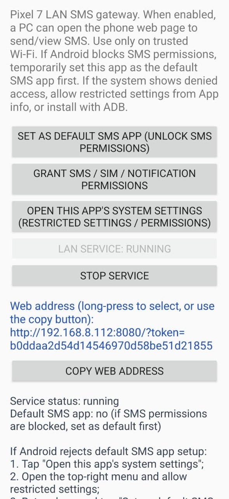
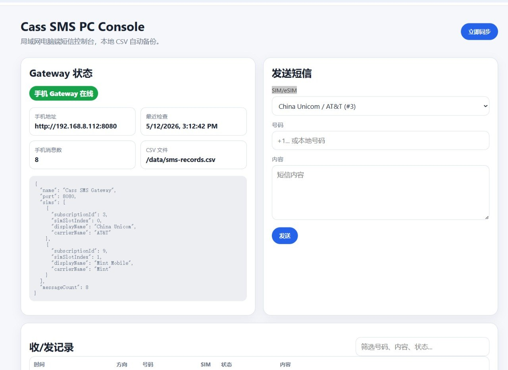
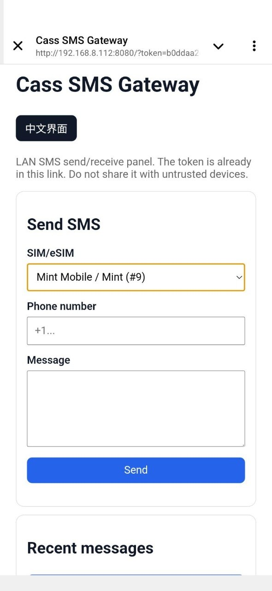

# Cass SMS Console

Cass SMS Console 是 [Cass SMS Gateway](https://github.com/YonggangG/cass-sms-gateway) 的局域网电脑端网页控制台。它运行在同一局域网内的电脑、NAS 或小主机上，连接手机端 Gateway，并提供浏览器界面用于发送短信、查看收发记录、选择 SIM/eSIM，以及把短信记录实时备份到本地 CSV 文件。

英文文档： [README.md](README.md)

## 截图

### Android Gateway 设置页



### 桌面网页控制台



### 手机网页控制台



## 功能

- 显示手机端 Cass SMS Gateway 在线 / 离线状态
- 从手机读取并选择 active SIM/eSIM
- 在局域网电脑网页上发送短信
- 查看手机 Gateway 缓存的收/发短信记录
- 自动同步短信记录，并把新增记录追加写入本地 CSV
- 支持直接运行 Node.js，也支持 Docker 容器部署
- 包含 Portainer Stack 示例

## 工作方式

```text
浏览器 / Portainer 主机
        |
        v
Cass SMS Console :3000
        |
        v
运行 Cass SMS Gateway 的 Android 手机 :8080
```

手机仍然负责真正的短信发送和接收。本项目只是局域网网页控制台和本地 CSV 备份服务。

## 版本说明

- v0.1.2：避免短信实际发送成功却显示 “operation aborted” 失败：发送确认等待延长到 30 秒，若手机端确认超时则显示“已提交/确认超时”的提示。
- v0.1.1：修复网页 SIM/eSIM 下拉框在每 3 秒自动刷新后回到第一个选项的问题，选择后会保持固定。

## Docker 镜像

镜像标签：

```text
ghcr.io/yonggangg/cass-sms-console:latest
```

当前 GHCR 镜像可直接拉取。v0.1.2 Release 也提供预构建 Docker image archive，作为离线安装备用。

```bash
curl -L -o cass-sms-console-v0.1.2-docker-image.tar.gz \
  https://github.com/YonggangG/Cass-SMS-Console/releases/download/v0.1.2/cass-sms-console-v0.1.2-docker-image.tar.gz
gzip -dc cass-sms-console-v0.1.2-docker-image.tar.gz | docker load
```

## Portainer 快速部署

1. 在 Android 手机上安装并打开 Cass SMS Gateway。
2. 授权短信 / SIM / 通知权限。
3. 启动手机端局域网服务。
4. 复制手机 App 显示的访问地址，例如：

```text
http://192.168.1.23:8080/?token=abc123
```

拆成两部分：

- `CASS_PHONE_BASE_URL`: `http://192.168.1.23:8080`
- `CASS_TOKEN`: `abc123`

5. 在 Portainer 新建 Stack，粘贴下面内容：

```yaml
services:
  cass-sms-console:
    image: ghcr.io/yonggangg/cass-sms-console:latest
    container_name: cass-sms-console
    restart: unless-stopped
    ports:
      - "3000:3000"
    environment:
      CASS_PHONE_BASE_URL: "http://192.168.1.23:8080"
      CASS_TOKEN: "PASTE_PHONE_TOKEN_HERE"
      CASS_SYNC_INTERVAL_MS: "3000"
      CASS_CSV_PATH: "/data/sms-records.csv"
    volumes:
      - cass-sms-data:/data

volumes:
  cass-sms-data:
```

6. 部署后打开：

```text
http://运行 Docker 的电脑IP:3000
```

CSV 备份保存在 Docker volume `cass-sms-data` 内：

```text
/data/sms-records.csv
```

## Docker CLI 部署

```bash
docker run -d \
  --name cass-sms-console \
  --restart unless-stopped \
  -p 3000:3000 \
  -e CASS_PHONE_BASE_URL="http://192.168.1.23:8080" \
  -e CASS_TOKEN="abc123" \
  -e CASS_SYNC_INTERVAL_MS="3000" \
  -v cass-sms-data:/data \
  ghcr.io/yonggangg/cass-sms-console:latest
```

## 本地 Node.js 运行

需要 Node.js 18 或更新版本。

```bash
git clone https://github.com/YonggangG/Cass-SMS-Console.git
cd Cass-SMS-Console
cp config.example.json config.json
```

编辑 `config.json`：

```json
{
  "phoneBaseUrl": "http://192.168.1.23:8080",
  "token": "abc123",
  "host": "0.0.0.0",
  "port": 3000,
  "syncIntervalMs": 3000,
  "csvPath": "./data/sms-records.csv"
}
```

启动：

```bash
node server.js
```

打开：

```text
http://localhost:3000
```

## 环境变量

环境变量会覆盖 `config.json`。

| 环境变量 | 说明 | 默认值 |
| --- | --- | --- |
| `CASS_PHONE_BASE_URL` | 手机 Gateway 地址，不含 token | `http://192.168.1.23:8080` |
| `CASS_TOKEN` | 手机 Gateway token | 空 |
| `CASS_HOST` | 监听地址 | `0.0.0.0` |
| `CASS_PORT` | 控制台端口 | `3000` |
| `CASS_SYNC_INTERVAL_MS` | 同步间隔，单位毫秒 | `3000` |
| `CASS_CSV_PATH` | CSV 备份路径 | Docker 内默认为 `/data/sms-records.csv` |

## CSV 备份格式

```csv
id,timestamp_iso,timestamp_ms,direction,phone,text,subscriptionId,status
```

服务会定时从手机 Gateway 的 `/api/messages` 拉取记录，发现新记录后追加到 CSV 文件。

## 本地构建镜像

```bash
docker build -t ghcr.io/yonggangg/cass-sms-console:latest .
```

## 安全提醒

- 只建议在可信局域网使用。
- 不要把手机端 `8080` 或控制台 `3000` 暴露到公网。
- `CASS_TOKEN` 是控制 token，不要公开。
- CSV 文件会保存短信内容，请保护好主机和 Docker volume。

## License

当前是本地/私用友好的 MVP。如需更广泛公开分发，建议后续补充正式 license。
